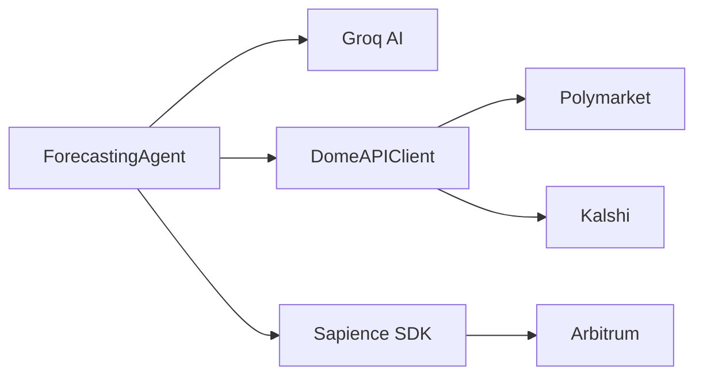

# Sapience Dual Agent - Forecasting + Trading

AI-powered prediction market agent for Sapience on Arbitrum. Generate probability forecasts using Groq AI, enriched with cross-platform market data from Dome API.

## Features

- 🤖 **AI-Powered Forecasting**: Use Groq's Llama 3.3 70B model for probability estimation
- 📊 **Cross-Platform Data**: Integrate Polymarket & Kalshi prices via Dome API
- ⛓️ **Onchain Submission**: Post forecasts to Sapience on Arbitrum via SDK
- 🎯 **Leaderboard Tracking**: Compete for accuracy rankings
- 💰 **Optional Trading**: Execute trades when edge is detected (requires USDe)

## Quick Start

See [QUICKSTART.md](QUICKSTART.md) for detailed setup instructions.

```bash
# Install dependencies
pnpm install

# Configure environment
cp .env.example .env
# Edit .env with your keys

# Test connections
node scripts/test-connection.js

# Run forecasting agent
pnpm dev
```

## Prerequisites

- Node.js 18+
- Ethereum wallet with ~0.01 ETH on Arbitrum
- [Groq API key](https://console.groq.com/keys) (free)
- Dome API key (contact Dome team)

## Documentation

- [QUICKSTART.md](QUICKSTART.md) - Complete setup guide
- [docs/ETHEREUM_SETUP.md](docs/ETHEREUM_SETUP.md) - Wallet & funding guide
- [docs/DOME_INTEGRATION.md](docs/DOME_INTEGRATION.md) - Dome API details

## Project Structure

```
src/
├── agents/
│   ├── forecasting-agent.ts    # Sapience forecast generation & submission
│   └── trading-agent.ts        # Trade execution (requires USDe)
├── utils/
│   ├── dome-client.ts          # Polymarket/Kalshi data client
│   └── market-analyzer.ts      # Market analysis utilities
└── config.ts                    # Configuration management

scripts/
├── wallet-helper.js            # Generate/check wallets
├── test-connection.js          # Test all API connections
└── wallet-setup.ps1            # Windows setup helper
```

## Architecture



## Configuration

Key environment variables in `.env`:

```env
PRIVATE_KEY=your_key_here
GROQ_API_KEY=your_key_here
DOME_API_KEY=your_key_here
AGENT_MODE=forecasting
MAX_FORECASTS=10
```

See [.env.example](.env.example) for all options.

## Usage

### 🧪 Dry Run (Test Without Real Money) - RECOMMENDED FIRST

Before trading with real money, test the trading agent in dry run mode:

```bash
# Quick test (2-3 markets)
pnpm test:dry-run

# Full dry run (up to 10 markets)
pnpm dry-run
```

This will:
- ✅ Fetch real market data
- ✅ Generate AI forecasts
- ✅ Show what trades the agent would make
- ✅ Calculate risk and expected returns
- ❌ NOT execute any real trades
- ❌ NOT spend any money

**See [DRY_RUN_GUIDE.md](DRY_RUN_GUIDE.md) for detailed instructions.**

### Forecasting Only (No Trading)

```bash
AGENT_MODE=forecasting pnpm dev
```

### Trading Mode (Requires USDe)

⚠️ **Run dry-run first!** See [DRY_RUN_GUIDE.md](DRY_RUN_GUIDE.md)

```bash
AGENT_MODE=trading pnpm dev
```

### Both Agents

```bash
AGENT_MODE=both pnpm dev
```

## Resources
cd sapience-arbitrage-rebalancer

# Install dependencies
npm install

# Set up environment
cp .env.example .env
# Edit .env with your API keys

# Start local development
npm run docker:up  # Start Redis & PostgreSQL
npm run dev       # Start agent

# In another terminal, start dashboard
npm run dashboard # Runs on http://localhost:3000
```

---

## 📚 Key Features

### ✅ Phase 1: Arbitrage Detection
- Real-time market data from Polymarket & Kalshi
- Automatic market matching across platforms
- Spread calculation & opportunity ranking
- Alert system (Discord, Telegram)
- Live dashboard

### ✅ Phase 2: Autonomous Trading
- Automated order placement
- Position tracking across platforms
- Risk management & slippage handling
- P&L calculation & tracking
- Transaction logging

### ✅ Phase 3: Portfolio Rebalancing
- Portfolio drift analysis
- Kelly Criterion position sizing
- Correlation-aware allocation
- Automatic rebalancing execution
- Liquidity-aware order sizing

### ✅ Phase 4: Sapience Integration
- Fetch Sapience forecasts for markets
- Compare forecasts vs. market prices
- Confidence-weighted opportunity scoring
- Track forecast accuracy over time
- Identify mispriced markets

---

## 🏗️ Architecture

```
ElizaOS Agent
  ├── DomeAPI Plugin    → Polymarket & Kalshi data
  ├── Sapience Plugin   → Forecast data & confidence
  ├── Trading Plugin    → Order execution & tracking
  └── Rebalancer Plugin → Portfolio optimization
       │
       ├─→ Redis Cache      (real-time data)
       ├─→ PostgreSQL       (trade history)
       └─→ Dashboard        (Next. js UI)
```

See [ARCHITECTURE.md](./ARCHITECTURE.md) for detailed architecture. 

---

## 📖 Documentation

- **[PROJECT_PLAN.md](./PROJECT_PLAN.md)** - Complete project breakdown & timeline
- **[ARCHITECTURE.md](./ARCHITECTURE.md)** - System design & plugin details
- **[SETUP.md](./docs/SETUP.md)** - Detailed setup instructions
- **[API. md](./docs/API.md)** - API reference
- **[PLUGINS.md](./docs/PLUGINS.md)** - Plugin development guide
- **[EXAMPLES.md](./docs/EXAMPLES.md)** - Usage examples

---

## 🔌 Plugin System

The agent uses a modular plugin architecture:

### DomeAPI Plugin
Fetches real-time market data from multiple prediction market platforms.

```typescript
const opportunities = await agent.call('domeapi. findArbitrageOpportunities', {
  threshold: 2.0,  // 2% minimum spread
  liquidity: 1000, // Minimum $1000 liquidity
});
```

### Sapience Oracle Plugin
Retrieves Sapience forecasts and confidence scores.

```typescript
const forecasts = await agent.call('sapience.getForecasts', {
  marketIds: ['0x123... ', '0x456...'],
});
```

### Trading Plugin
Executes trades on both Polymarket & Kalshi.

```typescript
const order = await agent.call('trading. placeOrder', {
  platform: 'KALSHI',
  market: 'BTC_100K_DEC31',
  side: 'BUY_YES',
  quantity: 100,
  limitPrice: 0.62,
});
```

### Rebalancing Plugin
Analyzes portfolio and executes rebalancing trades.

```typescript
const rebalancing = await agent.call('rebalancer.executeRebalance', {
  targetAllocation: { 'BTC_100K': 0.05, 'ETH_500':  0.03 },
});
```

---

## 📊 Dashboard

The included Next.js dashboard provides:

- 📈 **Real-time spread visualization** - See arbitrage opportunities as they appear
- 💼 **Portfolio metrics** - Current allocation, Sharpe ratio, correlation
- 📋 **Trade history** - All executed trades with P&L
- 🎯 **Performance analytics** - Win rate, average profit, Sapience accuracy
- 🚨 **Alerts** - Notifications for significant events

Launch it with:
```bash
npm run dashboard
```

---

## 🔒 Security

- ✅ Environment-based API key management
- ✅ No sensitive data in logs
- ✅ HTTPS-only external connections
- ✅ Transaction signing & nonce management
- ✅ Position limits & circuit breakers
- ✅ Encrypted configuration storage

---

## 📈 Performance Metrics

The agent tracks: 
- Spreads discovered per hour
- Trades executed daily
- Win rate %
- Cumulative P&L
- Sharpe ratio
- Sapience forecast accuracy
- API latency & error rates

View in dashboard or query via API.

---

## 🧪 Testing

```bash
# Run all tests
npm test

# Run with coverage
npm test: coverage

# Watch mode for development
npm test:watch

# Run specific test file
npm test -- spread-calculation.test.ts
```

---

## 📦 Deployment

### Local Development
```bash
npm run docker:up  # Start containers
npm run dev        # Start agent
npm run dashboard  # Start UI
```

### Production (Example:  Railway)
```bash
# Build Docker image
docker build -t sapience-agent .

# Push to registry
docker push your-registry/sapience-agent: latest

# Deploy with environment variables
railway up --env-file .env. production
```

See [SETUP.md](./docs/SETUP.md) for detailed deployment instructions.

---

## 🤝 Contributing

Contributions welcome! Please: 
1. Fork the repository
2. Create a feature branch (`git checkout -b feature/amazing-feature`)
3. Commit changes (`git commit -m 'Add amazing feature'`)
4. Push to branch (`git push origin feature/amazing-feature`)
5. Open a Pull Request

See [PLUGINS.md](./docs/PLUGINS.md) for plugin development guidelines. 

---

## 📞 Support

- **Hackathon:** https://www.sapience.xyz/hackathon
- **ElizaOS Docs:** https://docs.elizaos.ai/
- **DomeAPI Docs:** https://docs.domeapi.io/
- **Issues:** [GitHub Issues](https://github.com/21givenchy/sapience-arbitrage-rebalancer/issues)

---

## 📄 License

MIT License - See [LICENSE](./LICENSE) file for details

---

## 🙏 Acknowledgments

- **Sapience** for the prediction market platform & forecasts
- **ElizaOS** for the agent framework
- **DomeAPI** for unified market data access
- **Polymarket & Kalshi** for prediction market infrastructure

---

## 🎯 Roadmap

- [x] Market data fetching (DomeAPI)
- [x] Spread detection & ranking
- [x] Real-time alerting
- [ ] Autonomous trading execution
- [ ] Portfolio rebalancing
- [ ] Sapience integration
- [ ] Performance optimization
- [ ] Production deployment
- [ ] Community feedback & iteration

---

**Built for Sapience Hackathon 2025** 🚀

Last updated: December 2025
